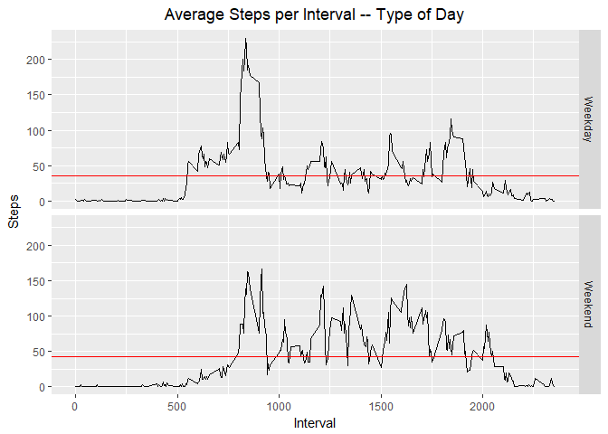

# Reproducible Research: Peer Assessment 1


## Loading and preprocessing the data

```r
library(dplyr)
library(ggplot2)
unzip("activity.zip")
stepdata <- read.csv("activity.csv")
stepdata$date <- as.Date(stepdata$date)
cleanstepdata <- stepdata[!is.na(stepdata$steps),]
```
## What is mean total number of steps taken per day?

```r
daysteps <- group_by(cleanstepdata,date) %>% summarize(steps = sum(steps))
hist(daysteps$steps, main = "Histogram of Daily Steps",xlab = "Steps")
```

<!-- -->

Mean number of steps taken per day: **10766**  
Median number of steps taken per day: **10765**


## What is the average daily activity pattern?

```r
intervalsteps <- group_by(cleanstepdata,interval) %>% summarize(steps = mean(steps))
ggplot(data = intervalsteps,aes(interval,steps)) + geom_line(data = intervalsteps[!is.na(intervalsteps$steps),]) +
  labs(title = "Average Steps per Interval", x = "Interval", y = "Steps") + theme(plot.title = element_text(hjust = 0.5))
```

<!-- -->

Interval **835** is the 5-minute period that has the highest number of steps across all days, with an average of **206**.  

## Imputing missing values
There are a significant number of **NA** observations in this dataset. The total number of **NA** values is **2304**, which is **13%** of the entire dataset. In order to fill in these gaps, we will take the average number of steps for each interval across all days and replace any NA values with the appropriate average.  


```r
filldata <- inner_join(stepdata,intervalsteps,by = "interval") %>% mutate(steps.x = ifelse(is.na(steps.x),steps.y,steps.x)) 
filldaysteps <- group_by(filldata,date) %>% summarize(steps.x = sum(steps.x))
hist(filldaysteps$steps.x, main = "Histogram of Daily Steps",xlab = "Steps")
```

<!-- -->

Mean number of steps taken per day: **10766**  
Median number of steps taken per day: **10766**  

Our method of imputing the missing data had minimal effect on the mean and median summaries of the dataset. The histogram also only shows an increase in the most frequent observations.  

Analysis of the missing data shows that it could be accounted for in eight days that were missing data for all 288 intervals. 


```r
nastepdata <- stepdata[is.na(stepdata$steps),]
table(nastepdata$date)
```

```
## 
## 2012-10-01 2012-10-08 2012-11-01 2012-11-04 2012-11-09 2012-11-10 
##        288        288        288        288        288        288 
## 2012-11-14 2012-11-30 
##        288        288
```

Since no days had partial data, replacing missing data with a mean across all days meant that the mean of all days would not be affected, even when grouping observations by interval. 


## Are there differences in activity patterns between weekdays and weekends?

```r
weekdaydata <- filldata %>% mutate(weekend = ifelse(weekdays(date) == "Sunday" | weekdays(date) == "Saturday", "Weekend", "Weekday"))
weekdayintervalsteps <- group_by(weekdaydata,interval, weekend) %>% summarize(steps = mean(steps.x))
meanwksteps <- group_by(weekdayintervalsteps,weekend) %>% summarise(wksteps = mean(steps))
ggplot(data = weekdayintervalsteps) + geom_line(aes(interval,steps)) + geom_hline(aes(yintercept=wksteps), color = "red", meanwksteps) + facet_grid(weekend ~ .) + 
  labs(title = "Average Steps per Interval -- Type of Day", x = "Interval", y = "Steps") + theme(plot.title = element_text(hjust = 0.5))
```

<!-- -->

Weekdays do appear to have more activity earlier in the day with the most active intervals of all days taking place in this time period.  However, the weekends are overall slightly more active than weekdays, with an average of **42** steps versus **36** steps during the weekdays.  
